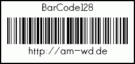

# BarCode128

-----

With this class you can create Barcodes in [Code 128](http://en.wikipedia.org/wiki/Code_128).

The Output is an Image (png | jpg | gif) and can be easily saved.

## Default Functionality

The basic code isn't that much...

**Example:**

```php
<?php
// get the class
require_once __DIR__.'/src/Barcode128.class.php';

// Text to be converted
$code = 'http://am-wd.de';

// Text printed above the barcode
$text = 'BarCode128';

// A font file located in the same directory
// http://openfontlibrary.org/en/font/hans-kendrick
$font = __DIR__."/data/HansKendrick-Regular.ttf";

// corresponding fontsize in px
$fontSize = 12;

// height of the barcode in px
$height = 130;

// create an Object of BarCode128 Class
$barcode = new AMWD\BarCode128($code, $height);

// OPTIONAL: add the font
// if not: no Text can be written (only bars)
$barcode->addFont($font, $fontSize);

// OPTIONAL: add the text above the barcode
$barcode->CustomText($text);

// Save the file to disk
$barcode->save('data/barcode.gif');

// OR: Draw the image to stdout
//$barcode->draw();
?>
```

**Result:**



-----

## Options

### User Text

You have the ability to print a custom text above the barcode

`$barcode->CustomText($text)`

`$text` is your custom text. If empty: no text will be displayed.

### Border

The barcode can be framed. So you can easily print and cut it out.

`$barcode->BorderWidth($value);`

`$value` is the size in Pixel. Zero means: no Frame. **Default:** 2

You can adjust the spacing between border and text/barcode

`$barcode->BorderSpacing($value);`

`$value` is the spacing in Pixel. **Default:** 10

### Barcode Width

The thickness of an bar can be adjusted, due to printers, with an lower resolution.

`$barcode->LineWidth($value)`

`$value` is the thickness in Pixel. **Default:** 1

### Text spacing

In images text spacing is important! If you choose a font, the info, how a character is "build", is saved as vector. While the image is created these infos will be converted into pixel information and sometimes the spacing will be to small to read the text aferwards.

`$barcode->TextSpacing($value)`

`$value` is the spacing in Pixel. **Default:** 5

### Print the Code

If you want to see your encoded text below the barcode you just need to set the value

`$barcode->ShowCode($value)`

`$value` is the switch and can be `true` or `false`. **Default:** true

### Font Resize

The text above the barcode (custom text) will always be in the font size you define at the beginning.
If you want the printed code to be resized, set the flag:

`$barcode->FontResize($value)`

`$value` is the switch and can be `true` or `false`. **Default:** false

### add/change the font

Only one font can be used! If you want to set (first call of the function) or change the font, you need this line:

`$barcode->addFont($font, $size);`

`$font` is the *absolute* path to your font file (recommendation: TrueTypeFont: ttf). **Default:** false

-----

## Output

The barcode has these options for an output

### get()

with this option you'll get the resulting image (binary) returned. So it may be possible to save many images in an array before printing them.

`$bc = $barcode->get();` or `$bc = $barcode->get($type);`

`$type` is optional and can be: png, jpg or gif. **Default:** png

### draw()

with this option you print the resulting image (binary) to the stdandard output (screen).
This is your option, if you want to create dynamic barcodes (without saving them)

`$barcode->draw()` or `$barcode->draw($type)`

`$type` is optional and can be: png, jpg or gif. **Default:** png

### save()

with this option you save the resulting image to the given path (absolute path!).
The type will be extracted from the file extension.

`$barcode->save($file)`

`$file` has to be an absolute path. Possible file extensions: png, jpg or gif
If an unknown extension is used the barcode image will choose *png* encoding.

## Environement

- PHP >= 5.3.10
- GD Version 2.0
- Apple MacBook Pro 15-inch (Late 2011)
- Raspberry Pi Typ B (as server)

## Bugs / Issues

Please report bugs to [Bitbucket | Issues](https://bitbucket.org/BlackyPanther/barcodes-128/issues)

## Sources

- Font: [Open Font Library](http://openfontlibrary.org/en/font/hans-kendrick)
- Encoding: [Wikipedia](http://en.wikipedia.org/wiki/Code_128)

-----

### LICENSE
My scripts are published under [MIT License](https://am-wd.de/index.php?p=about#license).
